# Damabok Skills

Orchestrated data-governance pipeline: **from any repository path to an OpenMetadata proposal.**

A single orchestrator agent (`damabok-orchestrator`) drives a chain of skills that turn a repository's domain vocabulary into governed, machine-consumable metadata. Distributed as a **Claude Code Plugin**, or usable unpackaged in **opencode** or Claude Code by cloning this repo directly.

## Quickstart

```
# 1. Install (once)
/plugin marketplace add <path-or-url-to-this-repo>
/plugin install damabok

# 2. Run it against a repository
damabok-orchestrator: run the pipeline on /path/to/some/repo
```

That's it — no config file, no target-repo setup. The orchestrator detects the repo's stack, bootstraps a glossary if none exists, and reports what it found. It defaults to **preview**: nothing is written into the target repo (ever — that's a hard rule, not a default), and the sibling `damabok-assessment` output directory is where results land. Add `--apply` once you're happy with a run to skip per-phase preview confirmations on future runs.

First run against a repo takes a few minutes and a real reasoning budget — it's reading actual code to build a glossary from scratch. A second run against the same repo is much cheaper: it reconciles pending vocabulary candidates instead of re-deriving everything, and asks at most one batch of 3–5 questions.

A finished run produces one directory per analyzed repo under `OUTPUT_REPO/<repo-slug>/` — see [Output location](#output-location) below for its layout and what each file contains.

## Pipeline

```
TARGET_REPO  (read-only — never written to)
   │  domain-business-modeling — the pipeline's only gate
   │    bootstrap if CONTEXT.md is missing, else reconcile last run's candidates
   │    ▲
   │    └─── proposed vocabulary candidates from stages 2 and 3, gated next run
   ▼
CONTEXT.md            ──►  context.json             domain glossary
   │  context-lineage-generator
   ▼
CONTEXT_LINEAGE.md    ──►  context-lineage.json     concept × data read/write inventory
   │  dama-assessment
   ▼
DAMA_ASSESSMENT.md    ──►  dama-assessment.json     master / reference / transactional + golden records
   │  openmetadata-mapper
   ▼
OPENMETADATA_MAPPING.md ──► OPENMETADATA_MAPPING.json
   │
   ▼
OpenMetadata MCP (optional ingest)
```

At every stage: the **markdown is the human-editable source of truth**, the JSON is derived from it and validated against that stage's schema, and the next skill consumes the JSON. Everything lands in the output repo — never in the analyzed one.

**One gate, in stage 1.** Stages 2–4 never interrupt the user; they record what they are unsure about as rows in their own artifacts, carrying evidence and confidence, and the user settles those in the preview. Vocabulary findings become `proposed` candidates that `domain-business-modeling` gates on the next run — because it owns `CONTEXT.md` and is the only stage that can act on the answer. Accepted candidates are written into the glossary and their rows disappear; declined ones are marked `rejected` and never asked again. The pool shrinks every run.

Each transition below is one delegated skill, with the schema it validates against and the template it follows:

```mermaid
flowchart LR
    Repo(["Repo"]) --> C1["domain-business-modeling<br/>json: context.schema.json<br/>template: CONTEXT-FORMAT.md"]
    C1 --> CONTEXT["CONTEXT.md"]
    CONTEXT --> C2["context-lineage-generator<br/>json: context-lineage.schema.json<br/>template: CONTEXT-LINEAGE-FORMAT.md"]
    C2 --> LINEAGE["CONTEXT_LINEAGE.md"]
    LINEAGE --> C3["dama-assessment<br/>json: dama-assessment.schema.json<br/>template: DAMA-ASSESSMENT-FORMAT.md"]
    C3 --> DAMA["DAMA_ASSESSMENT.md"]
    DAMA --> C4["openmetadata-mapper<br/>json: openmetadata-mapping.schema.json<br/>template: OPENMETADATA-MAPPING-FORMAT.md"]
    C4 --> OMM["OPENMETADATA_MAPPING.json"]
    OMM --> C5["MCP ingestion<br/>validate: openmetadata-mapping.schema.json<br/>template: OPENMETADATA_MAPPING.md"]
    C5 --> MCP(["MCP (openmetadata)"])
```



See [`damabok-assessment`'s README](../damabok-assessment/README.md#the-pipeline-stage-by-stage) for a stage-by-stage description of what each skill does, every section of every resulting file, and how to work through a finished assessment.

## Output location

Artifacts go to `OUTPUT_REPO/<repo-slug>/`, defaulting to the sibling [`damabok-assessment`](../damabok-assessment) repo — one directory per analyzed repository. The analyzed repo is read-only input.

Centralizing output keeps governance artifacts out of the repos they describe, and puts every analyzed repo's vocabulary side by side — the precondition for cross-repo synergy analysis (not built yet).

## Usage

**As a Claude Code Plugin (packaged)** — see Quickstart above for the install commands. Invoke the orchestrator from any project once installed; add `--apply` to skip per-phase preview confirmations.

**Unpackaged, in opencode or Claude Code:** clone this repo and work inside it directly — opencode reads `skills/` and `.opencode/agents/damabok-orchestrator.md` at their repo-relative paths with no install step; `.claude/skills` and `.claude/agents/damabok-orchestrator.md` are symlinks into the same files, so Claude Code discovers them identically when this repo itself is the working directory.

Either way, the orchestrator delegates each phase to a sub-agent that loads the phase's `SKILL.md` first. The skills' content is identical across every path — packaged or not, opencode or Claude Code; only how the orchestrator resolves its own root path differs, and only the two orchestrator agent files (plus `ORCHESTRATION.md`, their shared canonical source) know about that difference.

## Structure

```
.claude-plugin/
├── plugin.json                 plugin manifest
└── marketplace.json            local marketplace entry, for install-testing
skills/
├── damabok-shared/              contracts every skill references
│   ├── AMBIGUITY-GATE.md       who asks, and where everyone else records
│   └── SCHEMA-CONVENTIONS.md   JSON complexity budget and uniform shapes
├── domain-business-modeling/   glossary + ADRs      (CONTEXT.md, context.schema.json)
├── project-lineage-generator/  asset/process lineage (PROJECT_LINEAGE.md)
├── context-lineage-generator/  concept × data I/O   (CONTEXT_LINEAGE.md, context-lineage.schema.json)
├── dama-assessment/            DAMA-DMBOK classes   (DAMA_ASSESSMENT.md, dama-assessment.schema.json)
└── openmetadata-mapper/        OpenMetadata v1.12   (md source + json + schema)
agents/
└── damabok-orchestrator.md     packaged orchestrator — ORCHESTRATION.md inlined, plugin-root aware
ORCHESTRATION.md                the canonical playbook both orchestrators are kept in sync with
.opencode/agents/
└── damabok-orchestrator.md     unpackaged orchestrator, opencode wiring
.claude/
├── agents/damabok-orchestrator.md -> ../../agents/damabok-orchestrator.md   symlink
└── skills -> ../skills                                                     symlink
scripts/
├── validate_artifact.py        schema validator, stdlib only
└── test_validate_artifact.py   its self-tests
docs/
├── DECISIONS.md                index into adr/
└── adr/                        one architecture decision per file
opencode.json                   OpenMetadata MCP config, opencode format
.mcp.json                       OpenMetadata MCP config, Claude Code format
LICENSE                         Apache-2.0
```

## Design rules

Two shared contracts keep the four stages consistent:

- **[Ambiguity gate](skills/damabok-shared/AMBIGUITY-GATE.md)** — ask where the answer can be applied. Stage 1 owns `CONTEXT.md`, so it holds the run's only gate: 3–5 focused questions, batched. Every other stage records its uncertainty as rows in its own artifact — vocabulary findings as `proposed` candidates for stage 1 to gate next run, everything else with evidence and confidence for the user to settle in the preview. Nothing is dropped, and nothing blocks the write.
- **[Schema conventions](skills/damabok-shared/SCHEMA-CONVENTIONS.md)** — schemas stay deliberately small: at most two levels of nesting, `required` limited to fields that make a record meaningful, and optional-and-omitted rather than required-and-empty. `scripts/validate_artifact.py` enforces the supported keyword subset, so the budget cannot quietly erode.

## Notes

- The `openmetadata` MCP server URL in `opencode.json` and `.mcp.json` is environment-specific; adjust it (or remove the block) for another deployment.
- `project-lineage-generator` is included for asset-level lineage; the orchestrator focuses on the concept-level chain.
- These skills originated as an experiment that wrote artifacts directly into the analyzed repo itself, before the output-repo design existed. Any such pre-existing files are treated as a legacy migration seed: the orchestrator reads them once and re-homes them into the output repo, and never modifies the originals.

## Improvement ideas

Ranked roughly by leverage. Full reasoning for the first two is in [`docs/adr/`](docs/adr/); the rest are open, not yet written up.

1. **Move markdown→JSON derivation into code** ([ADR 0003](docs/adr/0003-derivation-into-code.md)) — proposed, not implemented. The first real run spent ~226k subagent tokens turning markdown tables into JSON, almost all of it deterministic transcription that a `derive_json.py` CLI could do for near-zero cost and perfect reproducibility. This is the single biggest remaining cost in the pipeline; everything else in this list is smaller.
2. **Per-delegation model assignment** ([ADR 0004](docs/adr/0004-model-selection-per-delegation.md)) — proposed, not implemented. A model table already exists (Opus for `domain-business-modeling` and `dama-assessment`, Sonnet for lineage and mapping, Haiku for `project-lineage-generator`); it just isn't wired into the orchestrator's delegation calls yet.
3. **A real opencode package format.** opencode has no marketplace or manifest mechanism today — the unpackaged path is "clone or copy this repo," documented but not one command. Revisit if/when opencode ships an equivalent to Claude Code Plugins.
4. **Cross-repo synergy analysis.** `damabok-assessment` centralizes every analyzed repo's vocabulary specifically so the same concept, defined differently in two repos, can be found. Nothing reads across repos yet — this would be a new skill, not a change to the existing four.
5. **The `_Avoid_` three-way classifier has one data point.** The synonym / disambiguation / missing-concept split ([ADR 0006](docs/adr/0006-avoid-three-relationships.md)) was designed and verified against a single glossary (~30 terms, one analyzed repo). The frequency heuristic behind "missing concept" (avoided by ≥2 terms, itself undefined) is plausible but untested at a different scale or in a differently-organized domain.
6. **No automated version-consistency check** between `.claude-plugin/plugin.json`'s version and each skill's own `metadata.version` in its `SKILL.md` frontmatter. Deliberately deferred as disproportionate tooling for a 1–2 person project (see the plugin-packaging commit history) — worth reconsidering if the skills start changing independently of each other.
7. **ADR placement is awkward for a read-only target repo.** `domain-business-modeling` can propose an ADR, but the pipeline can never write it into the analyzed repository (hard rule). Today that means an ADR is drafted into the output repo and a human copies it across by hand — workable, but worth a cleaner answer if ADR proposals become routine.
